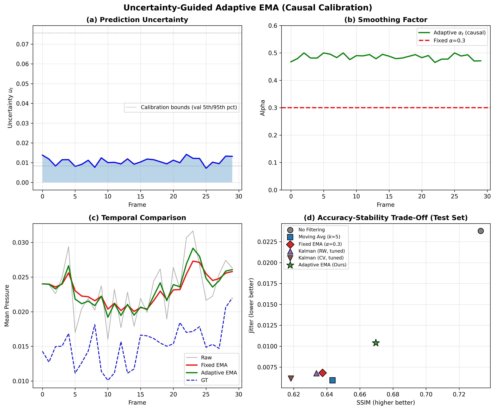
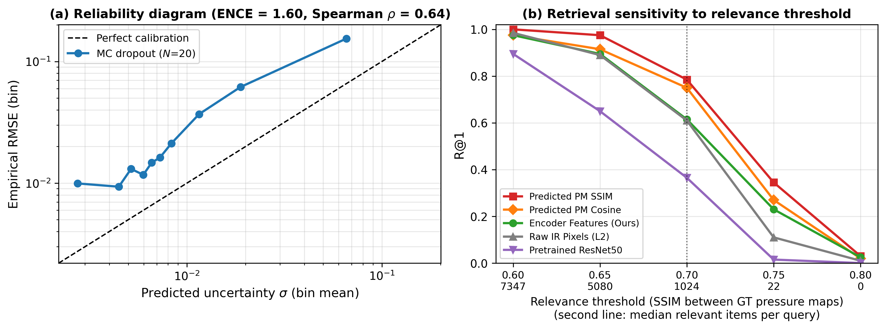

# Occlusion-Robust Pressure Pattern Retrieval From Thermal Imagery With Uncertainty-Guided Temporal Stabilization


**A thermal camera pointed at an occupied bed can estimate the body-pressure map
underneath the sleeper at SSIM 0.724 ± 0.044 — and pulling a thick blanket over
them costs 1.4% of that (0.727 → 0.717, n = 300 per condition). The contact
pressure mats this would replace cost roughly $2,000–$10,000 per bed.**

This repository holds the training and evaluation pipeline, the frozen metric
JSONs and the figures for a study on non-contact body-pressure estimation from
infrared (IR) video — plus the revision experiments that corrected several of
the original paper's headline numbers *downward*.

## The short version

Immobile patients develop pressure ulcers (bedsores) where body weight presses
the same skin against a mattress for hours. The clinical way to see this coming
is a pressure-sensing mat under the sheet: accurate, but expensive, fragile and
hard to clean between patients. Body heat conducts into the mattress roughly
where the body presses into it, so a thermal image of a bed carries a shadow of
the pressure map. We train a U-Net (ResNet-50 encoder) to go straight from one
IR frame to a dense pressure map. That works at SSIM 0.724.

Two things then decide whether it is deployable, and neither is single-frame
accuracy: the prediction **flickers** frame to frame even when the patient has
not moved, and real patients are **under blankets**. Occlusion turned out to be
nearly free — thermal signal reaches the blanket surface, so a thick blanket
costs 1.4% SSIM. We call that *robust*, not *invariant*: nothing in the loss
encourages it, so it is an empirical property of thermal sensing rather than an
architectural contribution.

Stability is a real trade-off, and it is the honest headline here: **every
smoothing filter we tried buys steadiness by paying accuracy.** Our method,
UA-EMA, sits at the accurate end of that curve — the *best* SSIM of any filter
and the *worst* jitter reduction. It is not free stability; it is a different
point on the same trade-off, reached without per-deployment tuning.

## Method

**UA-EMA (uncertainty-guided adaptive exponential moving average).** Run the
network `N = 20` times with dropout active (Dropout2d, p = 0.1, after the two
deepest encoder feature maps). The spread across passes is a per-frame
uncertainty `u`. Smooth the output stream with an EMA whose responsiveness
tracks that uncertainty:

```
alpha_t = alpha_max - u_hat * (alpha_max - alpha_min)      alpha_min = 0.1, alpha_max = 0.5
```

Confident frame → large alpha → follow the new prediction, so real motion gets
through. Uncertain frame → small alpha → lean on history, so flicker is
suppressed. `u_hat` is `u` rescaled by bounds **frozen from the validation
split** (5th–95th percentile = `[0.008, 0.076]`): the filter is causal and needs
no lookahead. Training: 50 epochs, Adam, lr 1e-4, batch 16,
loss = MSE + 0.1·(1 − SSIM), seed 42.

## Results

Data: **SLP** (Simultaneously-collected multimodal Lying Pose, ACLab/Northeastern).
The publicly released paired portion is **75 subjects / 9,858 paired IR+pressure
frames** (no blanket 3,310 / thin 3,260 / thick 3,288). Subject-disjoint split:
60 train subjects — 15 of them held out as a validation set used *only* to
calibrate the filter — and 15 test subjects / 1,963 test pairs.

**Single-frame accuracy** (test set):

| Model | SSIM | RMSE | MAE | PSNR |
|---|---|---|---|---|
| **U-Net (ResNet-50)** | **0.724 ± 0.044** | 0.054 ± 0.008 | 0.020 ± 0.003 | 25.50 ± 1.22 dB |
| U-Net++ | 0.712 | | | |
| DeepLabV3+ | 0.698 | | | |

**Temporal filtering**, 30 subject-disjoint test sequences. Jitter is
frame-to-frame change in the predicted map; lower is steadier.

| Filter | SSIM ↑ | Jitter ↓ | Jitter reduction | Tuning needed |
|---|---|---|---|---|
| No filtering | 0.733 | 0.0238 | — | — |
| Moving average, k = 5 | 0.643 | 0.0059 | 75.1% | window size |
| Fixed EMA, α = 0.3 | 0.637 | 0.0068 | 71.4% | α |
| Kalman, random walk (tuned) | 0.634 | 0.0068 | 71.6% | 25-point Q/R grid |
| Kalman, const. velocity (tuned) | 0.618 | 0.0061 | 74.2% | 25-point Q/R grid |
| **UA-EMA (ours)** | **0.670** | 0.0104 | 56.3% | **none (2 percentiles)** |

Paired Wilcoxon signed-rank across the 30 sequences, Holm-corrected for the 8
comparisons: every UA-EMA-vs-baseline difference is significant, corrected
p ≤ 1.68e-6 — in both directions. UA-EMA is reliably more accurate *and*
reliably less stable than the fixed-parameter filters. The MC-pass count matters
little (SSIM 0.662 / 0.665 / 0.670 at N = 5 / 10 / 20).



**Cross-modal retrieval** — given a new IR frame, find similar previously
recorded pressure patterns. 200 queries against a subject-disjoint gallery of
7,895 items; an item is relevant if its ground-truth pressure map has SSIM > 0.70
with the query's.

| Method | R@1 (95% CI) | mAP |
|---|---|---|
| Pretrained ResNet-50 features | 0.365 (0.301–0.434) | 0.217 |
| Raw IR pixels, L2 | 0.610 (0.541–0.675) | 0.303 |
| PCA + cosine | 0.600 (0.531–0.665) | 0.299 |
| Our encoder features | 0.615 (0.546–0.680) | 0.404 |
| Predicted pressure map + cosine | 0.750 (0.686–0.805) | 0.440 |
| **Predicted pressure map + SSIM** | **0.785 (0.723–0.836)** | **0.595** |

The recommended deployment strategy is therefore to *predict the pressure map and
compare in pressure space*, not to index encoder embeddings.

**Occlusion** (n = 300 per condition): no blanket 0.727 ± 0.041, thin blanket
0.729 ± 0.044 (+0.3%, within noise), thick blanket 0.717 ± 0.044 (−1.4%). No
sample in any condition fell below SSIM 0.60.

**Uncertainty calibration** (new): ENCE **1.60** — MC-dropout sigma is
overconfident in absolute scale. Its *ordering* is more useful: Spearman ρ = 0.64
between predicted uncertainty and error per pixel, ρ = 0.28 per frame. UA-EMA
consumes only percentile ranks, so absolute miscalibration does not propagate
into the filter — but the sigma must not be shown to a clinician as a confidence
number. **Latency** (batched MC dropout, L40S): 2.6 ms single pass, 3.5 ms at
N = 5, 5.4 ms at N = 20, 2.1 ms encoder-only.



## What the revision corrected

Several numbers in the earlier version of this README were wrong or overstated.
They are corrected above; this section says how.

- **A non-causal calibration bug.** The original code normalized uncertainty by
  each *test sequence's own* min–max — information from the future of that
  sequence. Refreezing the bounds on the validation split fixed it and SSIM went
  0.643 → 0.670. The bug made the method look worse, not better, but it was a
  bug.
- **"~71% jitter reduction" was never UA-EMA's number.** 71.4% is the fixed-EMA
  row; UA-EMA reduces jitter by 56.3%. The earlier Kalman comparison also used
  untuned Q/R on a different sample; the table above re-runs every filter on one
  protocol with a 25-point grid per Kalman variant, making the baselines *stronger*.
- **"77% Recall@1" was retired.** Under the scaled-up protocol (7,895 gallery
  items, up from 800) encoder features get **61.5%**, and the gap over ImageNet
  features is +25pp, not +41pp. That result is now framed as an analysis of what
  dense regression happens to learn, not the best retrieval method — predicted-map
  + SSIM at 78.5% is.
- **"Occlusion-invariant" → "occlusion-robust"** in the title, at a reviewer's
  request and correctly: no loss term promotes occlusion invariance.
- **The dataset count was wrong**: 75 subjects / 9,858 paired frames in the
  released paired portion, not "102 subjects".

## Limitations

- **One dataset, one rig.** SLP only: a single thermal camera, a single mattress,
  healthy volunteers posing lying positions. Nothing here has been near a
  clinical bed, a patient who cannot move, or a different camera.
- **Filtering costs accuracy** (0.733 → 0.670 SSIM) and **no user study shows a
  clinician prefers the steadier display.** That stability is worth accuracy is
  assumed, not demonstrated.
- **ENCE 1.60** — the uncertainty needs recalibration before any confidence value
  is surfaced to a human.
- **No learned metric baseline for retrieval.** No triplet or contrastive model
  was trained, so "our encoder beats ImageNet features" is a weak comparison.
- **Circularity in the retrieval protocol.** Relevance is defined by SSIM between
  ground-truth pressure maps while the training loss contains an SSIM term, which
  plausibly favours the SSIM ranking. It is also very threshold-sensitive: the
  median query has 7,347 relevant items at SSIM > 0.60 and 22 at SSIM > 0.75
  (Figure 6b), so R@1 across thresholds means more than any single value.
- Pressure maps are normalized, not calibrated to mmHg, and no ulcer outcome is
  predicted or validated.

## Repository structure

| path | contents |
|---|---|
| `src/01…23_*.py` | original pipeline: training, uncertainty/EMA, retrieval, figures |
| `src/24_revision_temporal_calibration.py` | revised temporal table: causal UA-EMA, tuned Kalman grids, MC-pass sweep, ENCE, latency, Wilcoxon + Holm |
| `src/25_revision_retrieval.py` | 200 queries × 7,895 gallery, five relevance thresholds |
| `src/26_revision_occlusion_analysis.py` | per-condition SSIM distributions and failure fractions |
| `src/27_revision_figures.py`, `src/29_revision_fig2.py` | Figures 6 and 2 |
| `src/28_base_seq_ssim.py` | single-pass (no dropout) sequence baseline |
| `result/revision/*.json` | frozen revision metrics; each `meta` block carries seed, git commit, config hash, device and timestamp |
| `result/figure/`, `result/unified/` | original per-experiment figures and metrics |

Every number above comes from `result/revision/*.json` or
`result/unified/unified_results.json`. Trained weights, the SLP data itself and
the manuscript are not distributed; retrain from `src/01_train_baselines.py`.
Dependencies: `torch`, `torchvision`, `segmentation-models-pytorch`,
`scikit-image`, `scikit-learn`, `scipy`, `opencv-python`, `numpy`, `matplotlib`.

## Status

Under major revision at **IEEE Access** (manuscript ID Access-2026-33087);
revision experiments run 2026-08-10. The manuscript, the reviews and the
response letter are not published here while review is in progress.

## Author & License

Woncheol Jeong. Code released under the MIT License (see `LICENSE`). The SLP
dataset is the property of its authors and is not redistributed.
