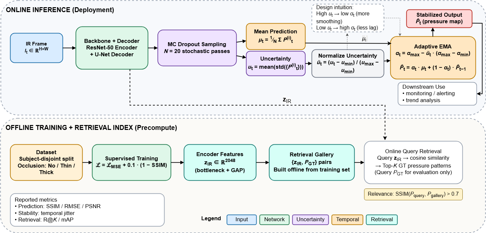

# Uncertainty-Guided Temporal Stabilization for Occlusion-Invariant IR-to-Pressure Mapping with Cross-Modal Retrieval



Non-contact body **pressure-map estimation from thermal infrared (IR) images**, aimed at
pressure-ulcer prevention in bedridden patients without contact pressure mats. The method
targets two clinical failure modes of frame-by-frame prediction — temporal instability and
robustness to bedding occlusion — and additionally learns representations suitable for
cross-modal (IR ↔ pressure) retrieval.

## Method

- **Uncertainty-Guided Adaptive EMA (UA-EMA).** Monte-Carlo Dropout (N = 20 stochastic
  passes) yields a per-frame uncertainty estimate that dynamically sets the EMA smoothing
  factor: high uncertainty → stronger smoothing (suppress flicker), low uncertainty → fast
  response to genuine pose changes. No manual tuning of a fixed smoothing constant.
- **Occlusion-invariant representation.** A U-Net (ResNet-50 encoder) trained for dense
  pressure regression stays discriminative across *uncovered / thin-blanket / thick-blanket*
  conditions.
- **Regression-guided cross-modal retrieval.** The regression-trained encoder yields
  embeddings usable for IR-to-pressure similarity search, without explicit metric learning.

## Results (SLP dataset)

Consolidated metrics (`result/unified/unified_results.json`):

| Metric | Mean ± Std |
|---|---|
| SSIM | 0.724 ± 0.044 |
| RMSE | 0.054 ± 0.008 |
| MAE  | 0.020 ± 0.003 |
| PSNR | 25.50 ± 1.22 dB |

Headline effects reported in the study: **~71% temporal-jitter reduction**, **1.4% SSIM
degradation** under thick-blanket occlusion, and **77% Recall@1** for cross-modal retrieval.

## Repository structure

```
src/                     # 23-step reproduction pipeline (01_train_baselines … 23_figures)
result/figure/           # rendered figures per experiment (overview, uncertainty/EMA,
                         #   retrieval, qualitative, t-SNE, per-condition, temporal)
result/unified/          # unified_results.json + consolidated figure
fig1.png                 # method overview (Figure 1)
```

## Reproduction

- **Data:** the public **SLP (Simultaneously-collected multimodal Lying Pose)** in-bed
  dataset (depth + IR + pressure map; ACLab / Northeastern Ostadabbas group).
- **Dependencies:** `torch`, `torchvision`, `torchmetrics`, `segmentation-models-pytorch`,
  `numpy`, `pandas`, `scipy`, `scikit-image`, `scikit-learn`, `opencv-python`, `Pillow`,
  `matplotlib`, `tqdm`.
- Run `src/01_train_baselines.py` … `src/23_figures_with_latex.py` in order. Trained
  weights are not distributed here; retrain from `src/01`.

## Author & License

Woncheol Jeong. Released under the MIT License (see `LICENSE`).
